<p align="center">
  
</p>

<h1 align="center">ScopeLock</h1>

<p align="center"><strong>Flight control for AI coding agents.</strong></p>

<p align="center">
  Define what agents may change, coordinate overlapping tasks, block scope drift,
  and keep a verifiable receipt of the result.
</p>

<p align="center">
  <a href="https://github.com/Daewooox/ScopeLock/actions/workflows/test.yml"></a>
  <a href="https://github.com/Daewooox/ScopeLock/actions/workflows/codeql.yml"></a>
  
  <a href="./LICENSE"></a>
</p>

<p align="center">
  
</p>

AI coding agents are fast, but they do not share a reliable understanding of
who may change what. Two agents can edit the same file, a small task can drift
into CI or auth, and the final result is difficult to audit.

ScopeLock adds deterministic guardrails around that workflow:

1. **Define the scope.** Approve allowed changes, blocked changes, and task
   context.
2. **Coordinate the work.** Detect overlapping tasks and order them safely.
3. **Verify the result.** Block supported out-of-scope writes, check git drift,
   and produce a local Flight Report.

ScopeLock is local-first and rule-based. Its drift engine and hooks do not need
an LLM or cloud service.

## Start here

The Guided interface creates the same contracts and reports as the advanced
commands, but keeps the normal path to three top-level commands:

```bash
scopelock setup
scopelock task start "Add a dark mode toggle" --agent claude

# Let the agent work, then verify the repository evidence
scopelock task finish --open
```

`task start` reviews and approves the boundary but never starts an agent.
Approval, instruction injection, and hook installation remain explicit
decisions. `task finish` checks drift and creates a local Flight Report; it
does not run the tests named in the contract.

The animation above is generated from real `scopelock` command output -
regenerate it with `pnpm demo:svg`. With reduced-motion enabled it stays on
the completed frame.

## Try the demo

The progressive demo creates a temporary repository and runs the shipped
Guided flow, then prepares a two-task plan with a real read dependency. It
saves the task report, source plan, and ready plan for inspection. It does not
need an API key and does not start an agent.

```bash
git clone https://github.com/Daewooox/ScopeLock.git
cd ScopeLock
corepack enable
pnpm install
pnpm demo:progressive
```

The final output names every reviewable artifact. Add `-- --keep-fixture` to
retain the temporary Git repository and receive an exact optional `run`
command. For a deeper deterministic comparison with simulated agents, run
`pnpm demo:flight-control`.

`corepack` ships with Node 22, but some newer Node releases dropped it from
the default install. If `corepack enable` reports "command not found", run
`npm install -g corepack` first, or skip it entirely and `npm install -g
pnpm@10` directly.

## What ScopeLock does

- **Scope contracts** define allowed changes, blocked changes, and advisory
  read dependencies per task.
- **Agent preflight** checks that required rules, skills, and hooks are present
  before work starts.
- **Conflict detection** finds write-write and read-write hazards between tasks.
- **Safe execution stages** keep dependent agents from running at the same time.
- **Runtime hooks** deny out-of-scope edits where the agent supports it and
  audit them everywhere else.
- **Receipts and Flight Reports** record what ran, what changed, what was
  blocked, and whether tests passed.

## Install

The npm packages are not public yet. Private beta testers receive one verified
bundle containing the core, CLI, and MCP tarballs from the same CI run. See the
[private beta quick start](docs/beta-quickstart.md) for the checked install and
uninstall commands.

To run ScopeLock from source:

```bash
git clone https://github.com/Daewooox/ScopeLock.git
cd ScopeLock
corepack enable
pnpm install
pnpm build
pnpm --filter @scopelock/cli link --global
```

You can now run `scopelock --help`. To avoid a global link, replace
`scopelock` with `node /absolute/path/to/ScopeLock/packages/cli/dist/index.js`.

## Coordinate several agents

<p align="center">
  
</p>

```bash
# Validate contracts, order hazards, check the harness, and compile a ready plan.
# ScopeLock auto-detects common project checks such as npm run check or swift test.
scopelock plan prepare plan.json --target claude --out ready-plan.json

# Run each task in a temporary worktree. The full repository check must pass
# before the combined patch can reach your working tree.
scopelock run ready-plan.json --yes --isolate --receipt receipt.json

# Inspect the evidence in a standalone local report
scopelock report receipt.json --open
```

Review `ready-plan.json` before running it. Nothing is silently approved or
executed: `plan prepare` never starts an agent, and `run` still requires
`--yes`. Read hazards are included by default; use `--no-read-hazards` only
when stale reads are intentionally safe. If ScopeLock cannot detect a project
check, preparation stops and asks for an explicit named shell-free check such
as `--validation-check tests npm test`. Repeat the flag to create an ordered
pipeline and use `--acceptance-check tests` to declare which required checks
constitute acceptance. The older `--validation-command` form remains accepted
as a single-check compatibility alias. For npm projects with a `prepare`
lifecycle, the ready plan also shows `npm run prepare` as a separate candidate
setup step; both setup and validation must pass before promotion.

For Automation, add `--json` to the preparation and inspection commands. The
same schemas, exit codes, and artifacts are used without prompts or animation.

## Agent support

| Agent | Contract instructions | Environment preflight | Enforcement |
|---|---:|---:|---|
| Claude Code | Yes | Yes | Pre-write deny in strict mode |
| Codex | Yes | Yes | Deny when the project hook is live-verified |
| Cursor | Yes | Yes | Isolated patch gate; hooks remain audit-only |

ScopeLock reports enforcement confidence honestly. A configured hook is not
called `live-verified` until an explicit harness probe confirms it for the
current configuration.

## Capability maturity

| Capability | Current evidence |
|---|---|
| Contracts, scheduling, and drift checks | Pilot: cross-platform CI and dogfooded |
| Claude Code strict hook | Live-verified |
| Codex hook | Degraded until the current project hook passes a live probe |
| Cursor hook | Audit-only |
| Isolated multi-agent execution | Pilot: Claude, Codex, and Cursor probes passed |
| Receipts and local Flight Report | Pilot |
| npm distribution | Release candidate: reproducible tarballs, dry-run evidence, and three-OS install smoke; not published |

`pilot` means implemented and exercised, not a production stability promise.
See the [release-readiness reference](docs/reference.md#release-readiness) for
the evidence and publication gates.

## Documentation

- [Contributing](CONTRIBUTING.md)
- [Private beta quick start](docs/beta-quickstart.md)
- [Five-minute silent demo script](docs/beta-demo.md)
- [Private beta feedback](docs/beta-feedback.md)
- [CLI and configuration reference](docs/reference.md)
- [npm beta release runbook](docs/release.md)
- [Running multiple agents safely](docs/parallel-workflow.md)
- [Beta validation and pilot protocol](docs/beta-validation.md)
- [Reproducible parallel example](examples/parallel/)
- [Agent environment preflight example](examples/agent-workspace/)
- [Security model](SECURITY.md) and [threat model](THREAT-MODEL.md)
- [Privacy](PRIVACY.md)

## Security boundary

ScopeLock protects against accidental scope drift and records tamper evidence.
It is not an OS sandbox and cannot stop a malicious same-user process with
unrestricted shell access. See [SECURITY.md](SECURITY.md) before using strict
enforcement in a sensitive repository.

## License

MIT - see [LICENSE](LICENSE).
