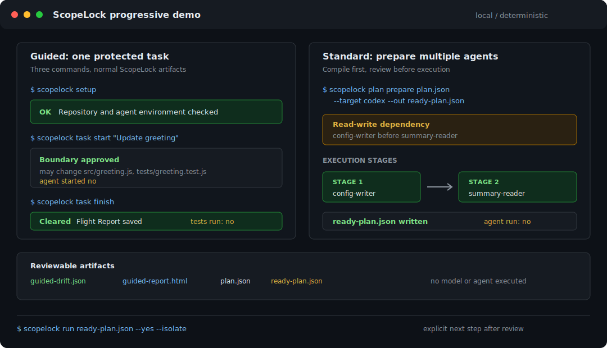

<p align="center">
  
</p>

<h1 align="center">ScopeLock</h1>

<p align="center"><strong>Flight control for AI coding agents.</strong></p>

<p align="center">
  Define what agents may change, coordinate overlapping tasks, block scope drift,
  and keep a verifiable receipt of the result.
</p>

<p align="center">
  <a href="https://github.com/Daewooox/ScopeLock/actions/workflows/test.yml"></a>
  <a href="https://github.com/Daewooox/ScopeLock/actions/workflows/codeql.yml"></a>
  
  <a href="./LICENSE"></a>
</p>

<p align="center">
  
</p>

AI coding agents are fast, but they do not share a reliable understanding of
who may change what. Two agents can edit the same file, a small task can drift
into CI or auth, and the final result is difficult to audit.

ScopeLock adds deterministic guardrails around that workflow:

1. **Define the scope.** Approve the files each task may read or change.
2. **Coordinate the work.** Detect overlapping tasks and order them safely.
3. **Verify the result.** Block supported out-of-scope writes, check git drift,
   and produce a local Flight Report.

ScopeLock is local-first and rule-based. Its drift engine and hooks do not need
an LLM or cloud service.

## Try the demo

The synthetic demo creates a temporary repository and walks through a failed
environment check, a safe two-stage plan, a blocked forbidden edit, and a final
receipt. It does not need an API key or a real project.

```bash
git clone https://github.com/Daewooox/ScopeLock.git
cd ScopeLock
corepack enable
pnpm install
pnpm demo:pilot
```

## What ScopeLock does

- **Scope contracts** define allowed, forbidden, and read-only paths per task.
- **Agent preflight** checks that required rules, skills, and hooks are present
  before work starts.
- **Conflict detection** finds write-write and read-write hazards between tasks.
- **Safe execution stages** keep dependent agents from running at the same time.
- **Runtime hooks** deny out-of-scope edits where the agent supports it and
  audit them everywhere else.
- **Receipts and Flight Reports** record what ran, what changed, what was
  blocked, and whether tests passed.

## Install

ScopeLock currently runs from source while the npm package is prepared:

```bash
git clone https://github.com/Daewooox/ScopeLock.git
cd ScopeLock
corepack enable
pnpm install
pnpm build
pnpm --filter @scopelock/cli link --global
```

You can now run `scopelock --help`. To avoid a global link, replace
`scopelock` with `node /absolute/path/to/ScopeLock/packages/cli/dist/index.js`.

## Basic workflow

```bash
# Initialize ScopeLock in your repository
scopelock init

# Describe and approve the task boundary
scopelock contract new \
  --task "Add a dark mode toggle" \
  --planned "src/ui/**" \
  --forbidden "src/auth/**" \
  --out dark-mode.json
scopelock approve dark-mode.json

# Give the contract to an agent and enable enforcement
scopelock inject-contract --target claude
scopelock hooks install --target claude --mode strict

# Verify the finished work
scopelock check-drift
```

When you dispatch a multi-task plan with `scopelock run`, the command prints
the receipt path and the exact `scopelock report --open ...` command to inspect
it in a browser.

## Agent support

| Agent | Contract instructions | Environment preflight | Enforcement |
|---|---:|---:|---|
| Claude Code | Yes | Yes | Pre-write deny in strict mode |
| Codex | Yes | Yes | Deny when the project hook is live-verified |
| Cursor | Yes | Yes | Post-edit audit |

ScopeLock reports enforcement confidence honestly. A configured hook is not
called `live-verified` until an explicit harness probe confirms it for the
current configuration.

## Documentation

- [CLI and configuration reference](docs/reference.md)
- [Running multiple agents safely](docs/parallel-workflow.md)
- [Reproducible parallel example](examples/parallel/)
- [Security model](SECURITY.md) and [threat model](THREAT-MODEL.md)
- [Privacy](PRIVACY.md)

## Security boundary

ScopeLock protects against accidental scope drift and records tamper evidence.
It is not an OS sandbox and cannot stop a malicious same-user process with
unrestricted shell access. See [SECURITY.md](SECURITY.md) before using strict
enforcement in a sensitive repository.

## License

MIT - see [LICENSE](LICENSE).
